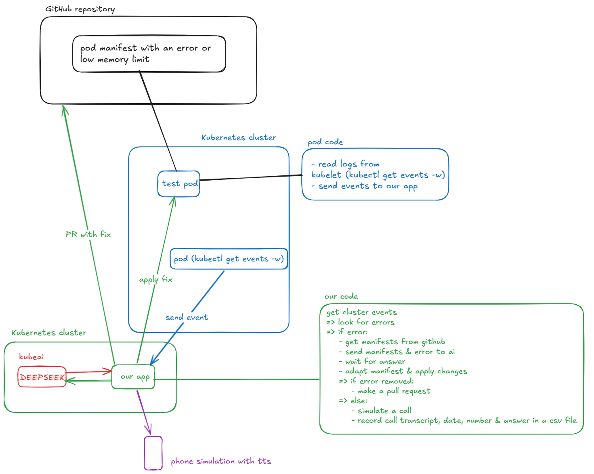

# Project Web

By Dziyana Tsetserava, Muriel Paraire and Vincent Font.

## Goal

"""

Développez un système scalable qui démarre un agent intelligent (hors cluster) capable de :

- Se connecter à un système de logs pour détecter les erreurs Kubernetes
- Tenter une résolution automatique de l'erreur via un modèle
- En cas de succès, ouvrir automatiquement une pull request
- En cas d'échec, passer un appel via IA à la personne d'astreinte
   - expliquer l'erreur à l'oral (le speech)
    - demander d'intervenir
    - Enregistrer dans un fichier:
        - l'heure de l'appel
        - le numéro appelé
        - le speech utilisé
        - la réponse (boolean) à la question, est ce qu'il peut intervenir?

"""

## Architecture



To view the project architecture and workflow in more detail, see [the pdf presenttion](presentation.pdf).

Going forward, we will call the cluster with our app the "app" cluster and the one with all our tools the "monitoring" cluster.

## Prerequisites

You need to have helm installed.

**Reminder:**

We need to have access to 2 clusters, here is an exemple of how we create them using k3d:
```
k3d cluster create monitoring
k3d cluster create app
```
If you already have two clusters available, you can skip this step.

## Kubernetes cluster "monitoring"

This is the cluster containing all necessary tools to monitor our application cluster as well as our AIs.

### KubeAi

To deploy the AI we are going to use [KubeAi](https://www.kubeai.org/).

```
helm repo add kubeai https://www.kubeai.org
helm repo update
helm install kubeai kubeai/kubeai --wait
helm install kubeai-models kubeai/models -f ./kube.monitoring_cluster/add_ais.yaml
kubectl port-forward svc/open-webui 8000:80
```

You can test that it worked by going to [localhost:8000](http://localhost:8000) and selecting the deepseek model.

You should be able to talk to an ai - either the deepseek-r1-1.5b or the qwen2.5-coder-1.5b model.

### AI fixer

This application will monitor the logs of the remote cluster and if there are any errors:
- ask the qwen model to modify the deployment manifest and apply that one in hopes of fixing the error
- if the error is fixed -> open a pull request
- else -> make a call to the phone-service to "call" the operator in charge

To deploy them, you need to first create a secret in the cluster containing the kubeconfig for the cluster that you want to read the logs from.
You can do it by generating a kubeconfig file and creatign a secret like this:
```
kubectl create secret generic kubeconfig --from-file=PATH/kubeconfig -n=monitoring
```

You also need to create a GitHubToken with sufficient permission to open a pull request.

### phone_service

Phone service app simulates a phone call executed if the AI doesn't manage to solve an error. It has the following endpoints:

- `/phone_call`: simulates a phone call and saves the answer to a csv file in its container
- `/tts`: creates a text using ai based on the error messages received and returns the mp3 created from the ai's answer
- `/phone_response`: transcribes the content of a mp3 stored on disc and saves it to a file (with sentiment analysis done with the ai)
- `/csv-results`: returns the csv file

Only `/phone_call` is used by AI-fixer, the rest are for 
demonstration purposes (to see the results of various steps that the `/phone_call` endpoint executes).

## Kubernetes cluster "app"

Here we only need to deploy our app in its namespace.

```
kubectl apply -f kube/app_cluster/namespace.yaml
kubectl apply -f kube/app_cluster/nginx.yaml
```

Our nginx application has a very small resource limit. We expect the AI fixer to increase it.