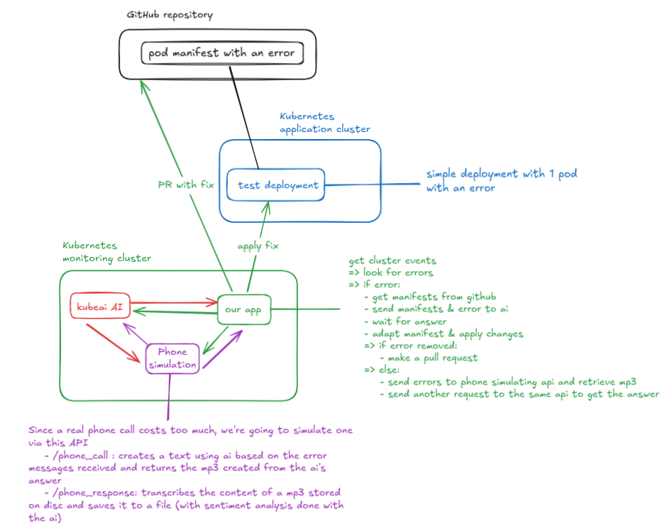

# Projet Web

## Sujet

Développez un système scalable qui démarre un agent intelligent (hors cluster) capable de :

- Se connecter à un système de logs pour détecter les erreurs Kubernetes
- Tenter une résolution automatique de l'erreur via un modèle
- En cas de succès, ouvrir automatiquement une pull request
- En cas d'échec, passer un appel via IA à la personne d'astreinte
   - expliquer l'erreur à l'oral (le speech)
    - demander d'intervenir
    - Enregistrer dans un fichier:
        - l'heure de l'appel
        - le numéro appelé
        - le speech utilisé
        - la réponse (boolean) à la question, est ce qu'il peut intervenir?


## Schéma d'architecture



Pour la suite, nous appellerons le cluster contenant les ias le "monitoring" et celui contenant les applications et pods à observer "app"

## Prérequis

avoir accès à deux cluster kubernetes  
nous l'avons testé avec k3d en local et helm d'installé.

**Pour rappel:**
créer 1 cluster qui s'appelle monitoring:
```
k3d cluster create monitoring
```

## Kubernetes cluster "monitoring"

Le cluster contenant les outils pour monitorer l'application ainsi que les ia.

### KubeAi

Pour déployer notre ai nous allons utiliser [KubeAi](https://www.kubeai.org/).

```
helm repo add kubeai https://www.kubeai.org
helm repo update
helm install kubeai kubeai/kubeai --wait
helm install kubeai-models kubeai/models -f ./kube.monitoring_cluster/add_ais.yaml
kubectl port-forward svc/open-webui 8000:80
```

You can test that it worked by going to [localhost:8000](http://localhost:8000) and selecting the deepseek model.

You should be able to talk to an ai - either the deepseek-r1-1.5b or the qwen2.5-coder-1.5b model.

### AI fixer

This application will monitor the logs of the remote cluster and if there are any errors:
- ask the qwen model to modify the deployment manifest and apply that one in hopes of fixing the error
- if the error is fixed -> open a pull request
- else -> make a call to the phone-service to "call" the operator in charge

To deploy them, 